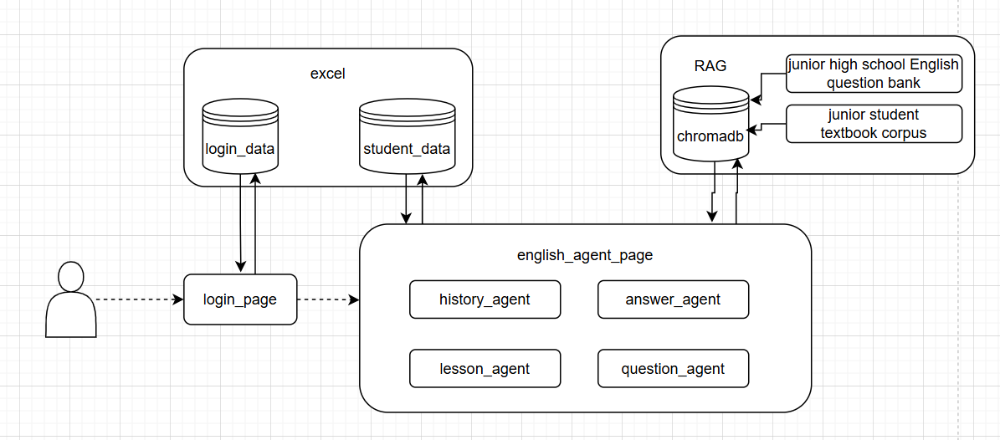
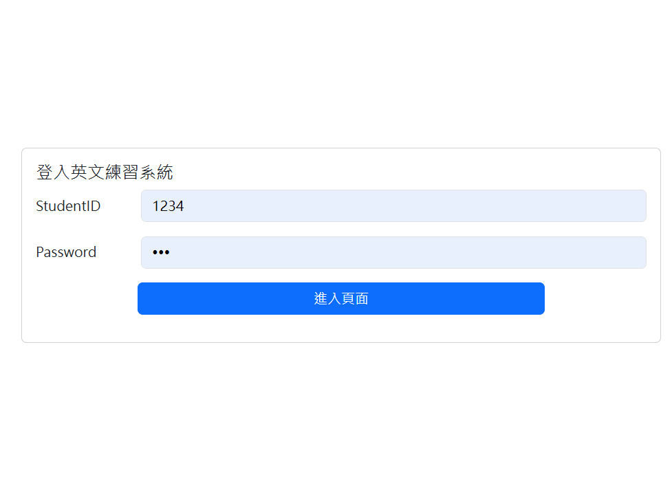
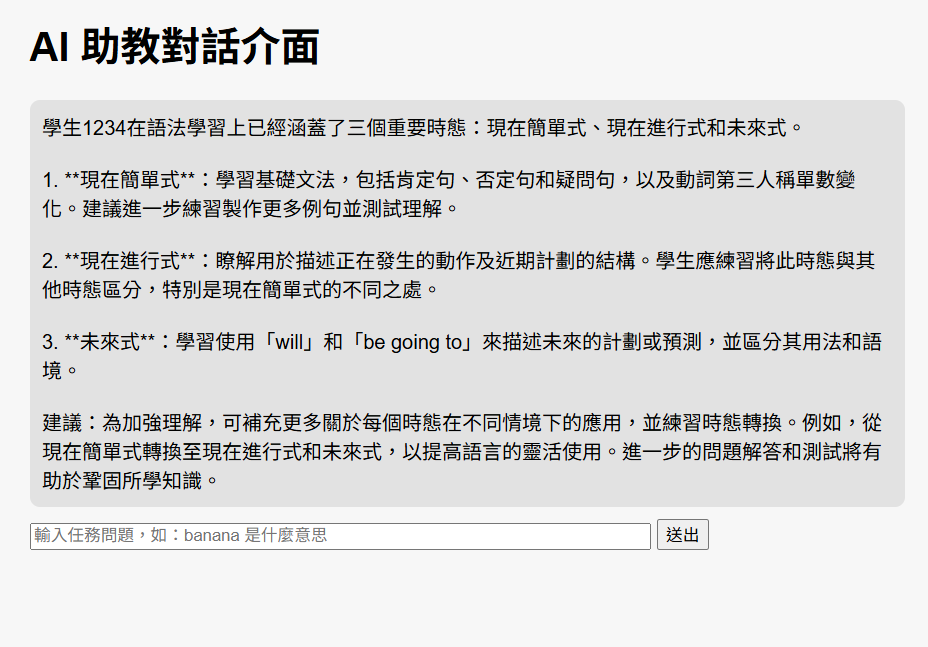
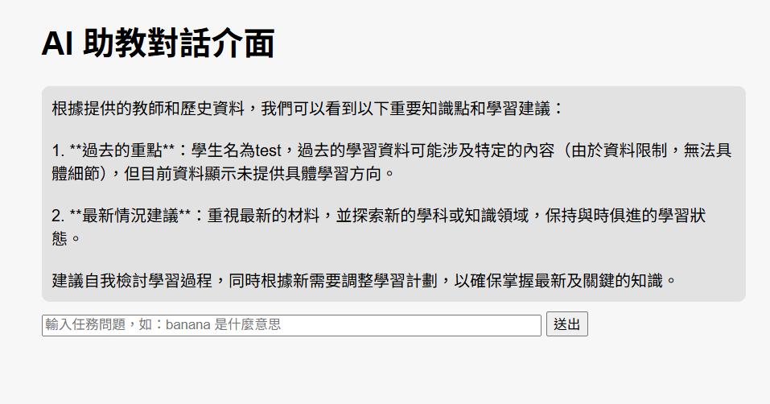

# EnglishAgent：Multi-Agent + Chroma RAG 英語學習助教系統

本專案旨在建構一套智慧英語學習平台，透過 Multi-Agent 架構與 Chroma 向量資料庫（Vector DB）結合 Retrieval-Augmented Generation（RAG）技術，協助教師與學生進行更精準、即時、個別化的教學與練習題生成。

## 目錄 Table of Contents

- [專案簡介](#englishagentmulti-agent--chroma-rag-英語學習助教系統)
- [專案目標與核心功能](#專案目標與核心功能)
- [系統流程圖](#系統流程圖)
- [資料儲存與使用者紀錄機制](#資料儲存與使用者紀錄機制)
- [技術堆疊](#技術堆疊)
- [實際操作流程](#實際操作流程)
- [解決的問題](#解決的問題)
- [擴充應用潛力](#擴充應用潛力)
- [快速啟動方式](#快速啟動方式)
- [出處](#出處)

---

## 專案目標與核心功能

### 輸入要素
- 教師提供關鍵詞（支援多詞性與彈性主題關鍵字）
- 系統可自動進行擴展與語意聚類

### 核心功能
1. **教學重點生成**：根據關鍵動詞，自動擴展出教學主題、核心概念與學習目標。
2. **題目產出**：自動生成符合教學目標的選擇題（包含題幹、選項與解析）。

### 技術架構概覽
- **輸入處理流程**：關鍵詞解析 → 同義詞擴展 → 語意聚類
- **題目生成流程**：根據學習進度與課綱難易度，生成合適的選擇題

###  預期效益
- 提升教學效率與題目品質
- 減少教師備課負擔
- 提供高彈性與擴充性支援

---

## 系統流程圖



### 系統說明：

1. 使用者登入系統，驗證帳號密碼（由 Excel 管理使用者帳密與歷史紀錄）。
2. 登入成功後，系統依據是否有歷史紀錄提供不同啟動訊息（協助新用戶快速上手）。
3. 使用者可輸入與英語相關的問題、題目需求或解析需求，系統會透過適當的 Agent 處理任務並從 Chroma DB 回傳答案與題目。
4. 每次任務完成後，系統會將使用紀錄存入資料庫，作為後續使用者歷程與記憶依據。

---

## 資料儲存與使用者紀錄機制

本系統採用 Google Sheets 結合 Google App Script 實作資料儲存功能，以便記錄使用者與 Agent 對話歷程及學習進度：

- 使用者登入後，系統會檢查帳號密碼是否存在於 Excel 資料表中。
- 每次使用者與 Agent 對話完成後，系統會將輸入agent類型、使用者提問內容、agent回覆，**透過 App Script 寫入對應的 Google Sheet**。
- 此方式具有：
  - 資料管理直觀：教師或管理者可直接檢視使用者操作紀錄
  - 可追蹤性強：適合進行學習歷程分析與後續教學診斷
  - 易於整合：未來可接入更多資料儲存與分析平台

資料紀錄範例欄位：
| AutoIndex | 使用者ID | category | userProblem | agentReply | 
|----------|------|------|-----------------------|-----------|
| 1 | test |lesson | 現在簡單式 | 現在簡單式 (Simple Present Tense) 基礎筆記.... | 
| 2 | test |question | 現在簡單式 | 題目1：What time does she _____ to school every day?... | 
---

## 技術堆疊

| 類別           | 工具 / 技術                           |
|----------------|----------------------------------------|
| LLM            | OpenAI GPT-4o                          |
| 向量資料庫     | Chroma Persistent Vector Store         |
| 向量嵌入模型   | `text-embedding-3-small` (OpenAI)      |
| 後端框架       | Flask                                  |
| 前端技術       | 原生 HTML + JavaScript                |
| Session 記憶   | Flask Session                          |
| 教材來源       | 康軒、翰林、南一 國中教材 PDF + 題庫 JSON |

---

## 實際操作流程

1. 登入介面輸入帳密，首次使用者可註冊帳號  
   

2. 登入後依使用者是否有歷史紀錄，呈現對應操作建議與說明  
     
   

---

## 解決的問題

- 傳統教案與題庫需手動整理撰寫，流程繁瑣
- 難以依據學生當下學習狀況即時調整題目
- 缺乏彈性與自動化機制，無法因應多元需求

---

## 擴充應用潛力

- 可應用於各學科、不同年級
- 搭配 AI 模型持續優化內容品質與難易度控制
- 可擴充為支援作文評分、口說評量等多種 Agent 系統
- 未來可整合 SPA 介面、學習圖表與徽章系統（Badge System）

---

## 快速啟動方式

### API Key 設定
1. 前往 [OpenAI](https://platform.openai.com/account/api-keys) 申請 API 金鑰
2. 將 `.env.template` 複製並重新命名為 `.env`
3. 在 `.env` 中填入您的 `OPENAI_API_KEY`

### 啟動流程
```bash
git clone https://github.com/sharsnow/EnglishAgent.git
cd EnglishAgent
pip install -r requirements.txt
python run.py
```
### 出處
此內容原作者來自於[Github](https://github.com/a88019401/ai_agents_homework_from-my-teammates)